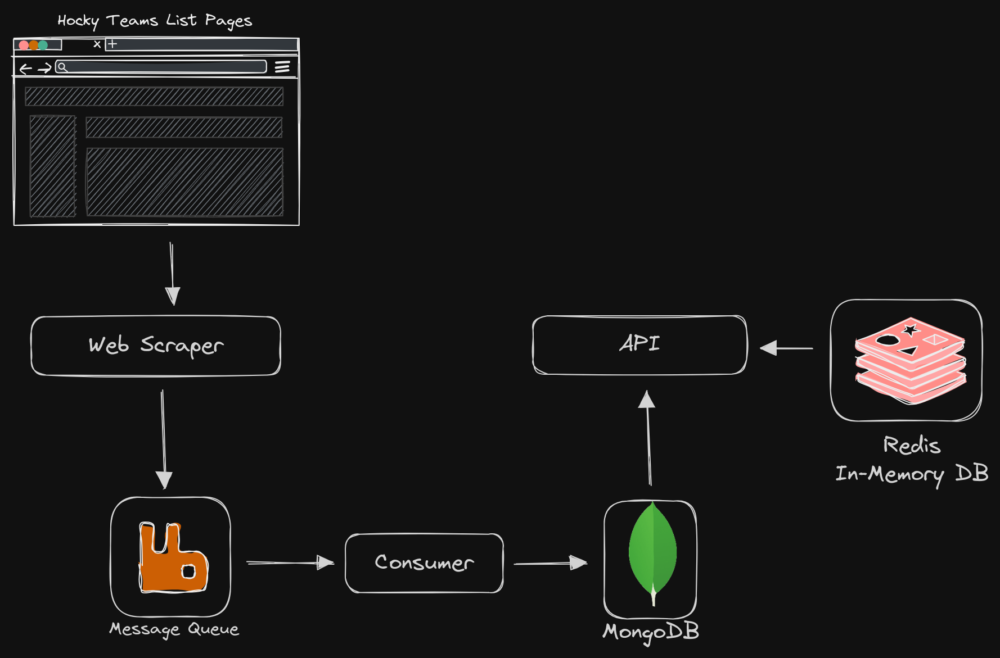

# Hockey Teams Scraper and API

## Components 

### Scraper

The scraper is a NodeJS script that will scrape this site [Hockey Teams information from scrapethissite.com](https://www.scrapethissite.com/pages/forms), and will publish the data to RabbitMQ queue.

### RabbitMQ

RabbitMQ is a message broker that will receive the data from the scraper and will publish it to the consumer service.

### Consumer Service

The consumer service is a Python script that will consume the data from the RabbitMQ queue and will store it in a MongoDB database.

### MongoDB

MongoDB is a NoSQL database that will store the teams data from the consumer service.

### Redis

Redis is an in-memory data structure store that will cache the teams data for the API to cache and get the requested teams data.

### API

The API is a NodeJS web server that will expose the teams data from the MongoDB database.

## Todo

- [x] Add Redis cache for the API
- [] Replace RabbitMQ with SQS
- [] Replace MongoDB with DynamoDB
- [] Replace API with Lambda and API Gateway
- [] Provision the infrastructure with Terraform
- [] Dockerize the components
- [] Deploy the components to Kubernetes
- [] Add a CI/CD pipeline
